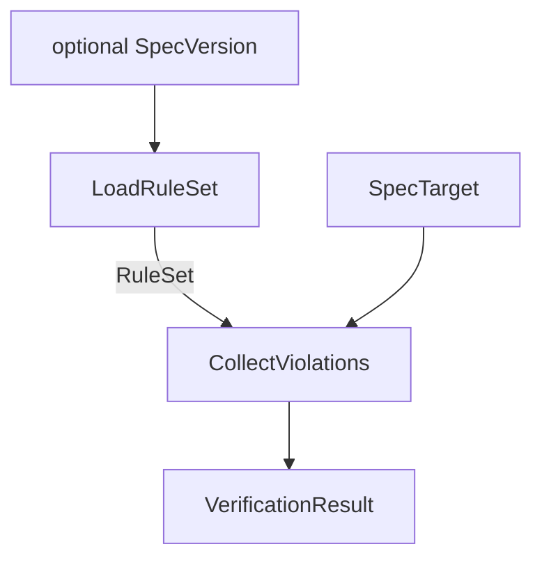

## Verify

**Purpose:** Checks a spec directory for conformance with AASDD structural conventions and reports all violations.

### Inputs

| Name | Type | Description |
| --- | --- | --- |
| `target` | [SpecTarget](../../concepts/cli/concept.md#spectarget) | The spec directory to verify. |
| `spec_version` | optional [SpecVersion](../../concepts/cli/concept.md#specversion) | The AASDD version to verify against. Defaults to the latest version known to the tool. |

### Outputs

| Name | Type | Description |
| --- | --- | --- |
| `result` | [VerificationResult](../../concepts/verification/concept.md#verificationresult) | All violations found, or an empty list if the spec is structurally conformant. |

### Invariants

- `result.passed` is `true` if and only if `result.violations` contains no `Error`-severity violations.
- Every violation in `result.violations` references an existing path under `target`.

### Failure Modes

| Failure | Condition | Effect |
| --- | --- | --- |
| `TargetNotFound` | `target.path` does not exist or is not a directory. | Error written to stderr; exit code non-zero. |
| `UnknownSpecVersion` | `spec_version` is provided but not recognised by the tool. | Error written to stderr; exit code non-zero. |

### Visualization

