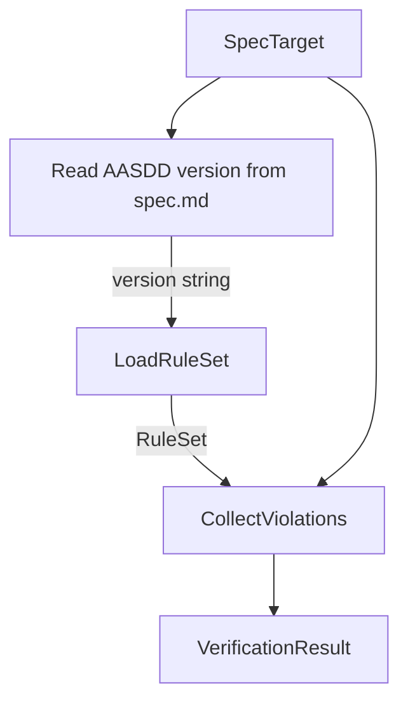

## Verify

**Purpose:** Checks a spec directory for conformance with AASDD structural conventions and reports all violations.

### Inputs

| Name | Type | Description |
| ---- | ---- | ----------- |
| `target` | [SpecTarget](../../concepts/cli/concept.md#spectarget) | The spec directory to verify. |
| `progress` | optional boolean | When `true`, passed through to `CollectViolations` for per-item output. |

### Outputs

| Name | Type | Description |
| ---- | ---- | ----------- |
| `result` | [VerificationResult](../../concepts/verification/concept.md#verificationresult) | All violations found, or an empty list if the spec is structurally conformant. |

### Invariants

- `result.passed` is `true` if and only if `result.violations` contains no `Error`-severity violations.
- Every violation in `result.violations` references an existing path under `target`.
- `result.aasdd_version` equals the AASDD version resolved during verification.
- `result.rule_count` equals the number of rules in the rule set used during verification.
- The AASDD version is read from the `**AASDD:**` label in `spec.md`. If the label is missing or unreadable, the latest version known to the tool is used.

### Failure Modes

| Failure | Condition | Effect |
| ------- | --------- | ------ |
| `TargetNotFound` | `target.path` does not exist. | Error written to stderr; exit code non-zero. |
| `TargetIsFile` | `target.path` is a file, not a directory. | Error written to stderr; exit code non-zero. |
| `ReadError` | A file under `target` cannot be read. | Error written to stderr; exit code non-zero. |

### Visualization

